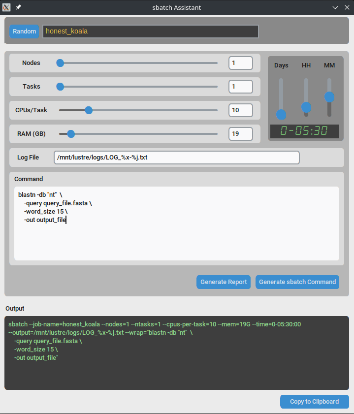

 **sbatchAssistant v1.0.0** is an user-friendly tool designed to streamline the creation and management of SLURM batch scripts for high-performance computing (HPC) environments. It offers a simple interface to simplify and automate the generation of sbatch scripts, making it easier for users to optimize their computational workflows. As picture is worth a thousand words, here is a screenshot of the GUI:
 
 